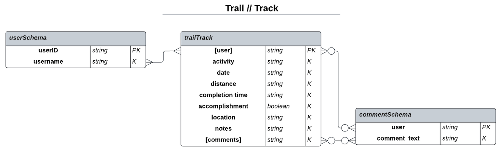
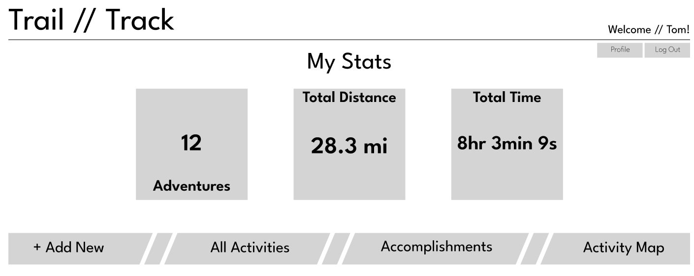
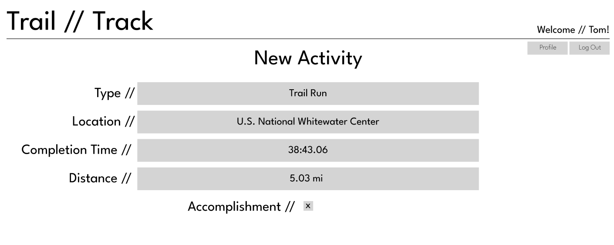

# Trail // Track

## Overview

**_Trail // Track_** is a solution to journal and showcase your outdoor adventures! Trail // Track enables users to document their outdoor activities like hiking, trail running, mountain biking, and more. Users are able to enter activities including details like activity type, location, completion time, pictures, and more. Show off to friends! Trail // Track will utilize the user's data to display reporting of completed activities, showcasing the collected data in graphical charts and interactive maps in a user profile that can be shared with friends.
###

## Getting Started
###
###
**Launch [Trail // Track here](https://xxx)!**
###
###
## Features
### Current Release _[v1.0.0]_ Features
- MERN-Infrastructure, React client and JS Express server hosting MongoDB database API.

- Basic, user-friendly, UI.

- Activity information stored in a _MongoDB_ database via JS Express server API and served to React client.

- User ability to mark certain Activities as 'Accomplishments.'

- Activity database entries can be _viewed/added/edited/deleted_ only by the authenticated user.

- User authentication utilizing Passport.

### Future Enhancements & Features
- Social interaction between users, users will be able to view each others Accomplishments in a user profile and make comments.

- Enhanced map integration.

### Technologies Used (Server)
    - HTML, CSS, JS
    - Express [4.18.2]
    - Express-Session [1.17.3]
    - MongoDB [6.1.0]
    - Mongoose [7.6.2]
    - Axios [1.5.1"]
    - dotenv [16.3.1]
    - Passport [0.6.0]
    - Passport-Local [1.0.]

### Technologies Used (Client)
    - HTML, CSS, JS
    - React [18.2.0]
    - React-DOM [18.2.0]
    - React-Router-DOM [6.16.0]
    - React-Scripts [5.0.1]
    - React Google Maps API [2.19.2]
    - Axios [1.5.1]

## Entity Relationship Diagram (ERD)

###

## Screenshots
### _Home Page_

### _App Functions_
##

## User Stories

### Current (In-Progress)
    - As a user, I want to be able to see my activity data displayed in a visual/graphical manner.
    - As a user, I want to be able to showcase my activity data in a personal user profile that can be viewed by others.
    - As a user, I want the application to take the location data for each activity I enter and have the location displayed in an interactive map.
    - As a user, I want the ability to allow other users interact with my user profile and leave comments.

### Ice Box (Future Enhancements)
    - As a user, I want the application to have an adventure-themed design.

### Completed (MVP)
    - As a user, I want the ability to load the application in a web browser.
    - As a user, I want the ability to store activity data in a database for the information to be recalled in the future for later use.
    - As a user, I want the ability to edit or otherwise modify activity data that was previously entered.
    - As a user, I want the ability to delete activity data that was previously entered.
    - As a user, I want to be able to store details related to each activity including, at minimun, Activity Type, Distance, Completion Time, and Location.
    - As a user, I want the ability to mark certain noteoworthy activities as 'Accomplishments.'
    - As a user, I want the ability to be the only person with the ability to add, edit, or delete personal activity data.
    - As a user, I want the ability to 'log in' to the app to only see and make changes to my information.
    - As a user, I want the ability to interact with the application and database in a manner that is user friendly and familiar to the look and feel of other apps I use regularly.

## Wireframes

### Login Page

#
### Main Landing Page

#
### Enter New Activity

#